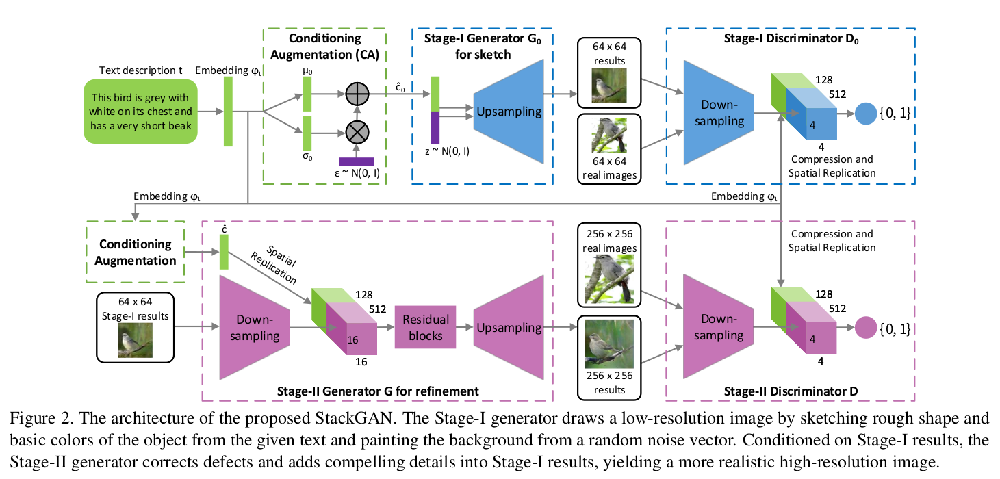
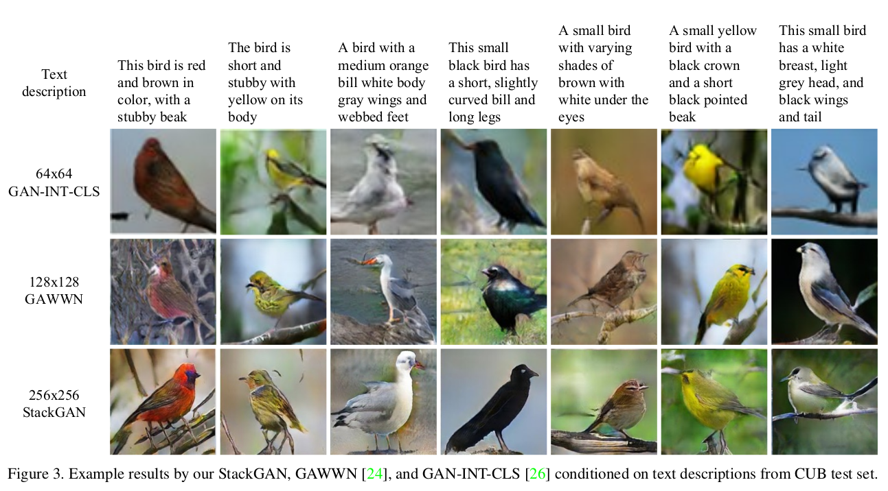
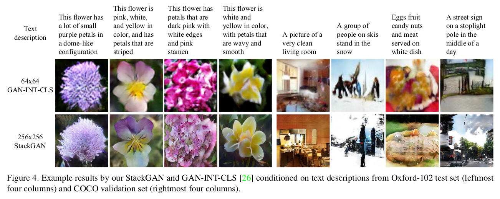
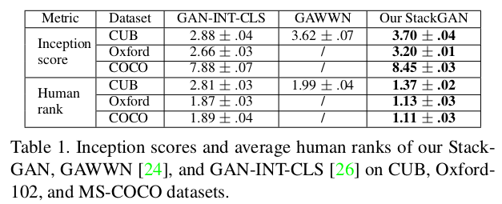
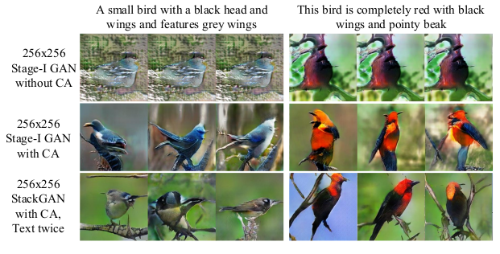
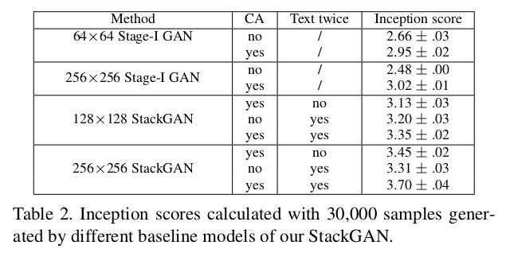

## StackGAN 阅读笔记
***

[StackGAN论文下载链接(arxiv)](https://arxiv.org/pdf/1612.03242.pdf)
### 创新点
* 提出多尺度的GAN
	* Stage-I GAN
	* Stage-II GAN

Stage-I GAN 主要是根据文本描述抓取目标物体的主要形状轮廓和一些基础色块，生成低分辨率的图片。

Stage-II GAN 修正Stage-I生成的低分辨率图片，并且根据再次阅读文本描述完善细节，生成高分辨率图片。

* Conditioning Augmentation(条件增强技术)

如果直接把 $\varphi_t$ 放入生成器，这个特征空间的维度一般比较高（>100）而训练数据是有限的，所以会造成特征空间不连续，不利于生成器的训练。

而作者提出的Conditioning Augmenetation是从独立的高斯分布$N(\mu (\varphi _{t})$,$\Sigma (\varphi _{t}))$中随机采样得到隐含变量，再放入生成器。其中$\mu (\varphi _{t})$和$\Sigma (\varphi _{t})$是关于$\varphi _{t}$的均值和方差函数。

另外，作者为了增强平滑度和避免过拟合，为生成器的损失函数增加了以下的正则项：

$$
D_{KL}(\mathcal{N}(\mu(\varphi_t),\Sigma(\varphi_t)) || \mathcal{N}(0,I))\tag{2}
$$

###损失函数
GAN的原始目标函数：
$$
\begin{split}
minmaxV(D,G)=&\mathbb{E}_{x_\thicksim{p_{data}}}[logD(x)]+\\
&\mathbb{E}_{z\thicksim{p_{data}}}[log(1-D(G(z)))]
\end{split}\tag{1}
$$

StackGAN的目标函数：
$$
\begin{split}
\mathcal{L}_{D_{0}}=&\mathbb{E}_{(I_0,t)\thicksim p_{data}}[logD_0(I_0,\varphi_t)]+\\
&\mathbb{E}_{z\thicksim p_z,t\thicksim p_{data}}[log(1-D_0(G_0(z,\hat{c}),\varphi_t)],
\end{split}\tag{3}
$$
$$
\begin{split}
\mathcal{L}_{G_{0}}=&\mathbb{E}_{z\thicksim p_z,t\thicksim p_{data}}[log(1-D_0(G_0(z,\hat{c}),\varphi_t)]+\\
&\lambda D_{KL}(\mathcal{N}(\mu(\varphi_t),\Sigma(\varphi_t)) || \mathcal{N}(0,I)),
\end{split}\tag{4}
$$

实验中作者把$\lambda $全部都设置为了1。

###实验数据
* CUB  contains 200 bird species with 11,788 images
Oxford-102 [21]
* Oxford-102 contains 8,189 images of flowers from 102 different cat-
egories.
* In our experiments, we directly use the pre-trained Inception model for COCO dataset
###实验效果

###复现
[待复现]()